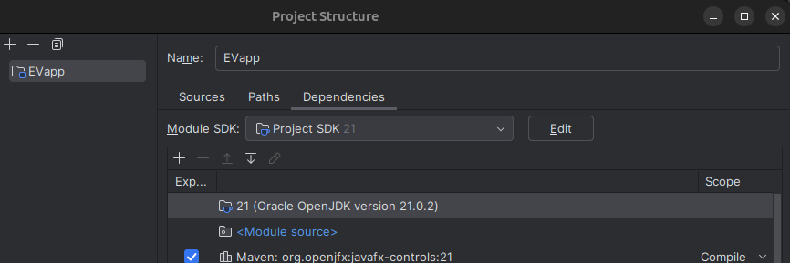
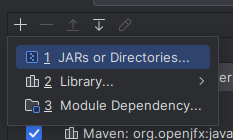
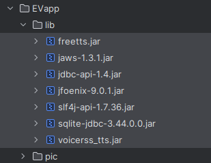
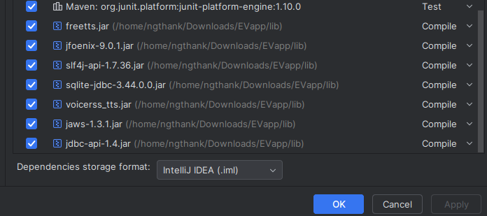
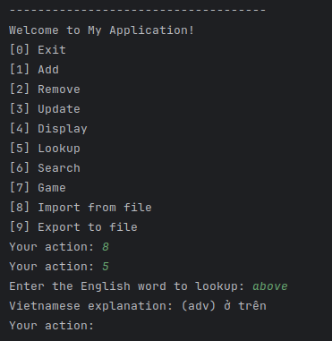
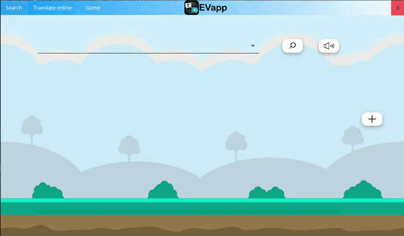
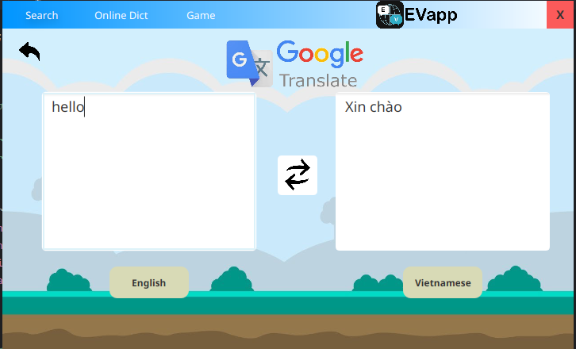
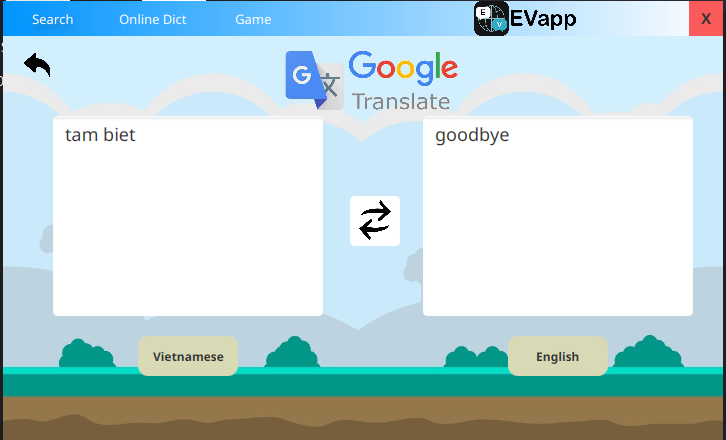
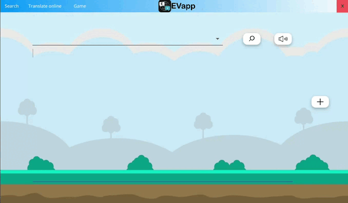
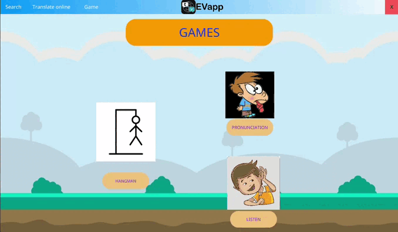

# EV app - Translate application from English to Vietnamese
This is an application that supports users in translating and learning English 
and Vietnamese. The application provides features such as text translation, 
text-to-speech reading, and a friendly interface to perform these functions 
easily and conveniently. In this app have 2 phases:
- Dictionary Commandline
  - [Word](./src/main/java/evapp/base/Word.java)
  - [Dictionary](./src/main/java/evapp/base/Dictionary.java)
  - [DictionaryCommandline](./src/main/java/evapp/base/DictionaryCommandline.java)
  - [DictionaryManagement](./src/main/java/evapp/base/DictionaryManagement.java)
- Dictionary App
  - [API](./src/main/java/evapp/API.java)
  - [Main Scene](./src/main/java/evapp/mainScene.java)
## Inheritance tree

## Setup Libraray
- Open `Project Structure` 
- Click `+` then click `JARs or Directories`

- Next step, click all file on folder lib

- Finally, click on the `empty box` and `apply` then `OK`

## Demo 
- Demo Dictionary Commandline: lookup work in data

- Demo App interface
  - Search word
    
  - Google Translate 
    - English to Vietnamese
      
    - Vietnamese to English
      
  - Game
    - Listening game
      
    - Hangman game
      
    - Pronunciation game
      
## Authors
| No | Name                   | Id            | Github                                            | Mission                                                                                                                                  |
|:---|:-----------------------|:--------------|:--------------------------------------------------|:-----------------------------------------------------------------------------------------------------------------------------------------|
| 1  | Phạm Văn Mạnh      | 21020449  | [@emvipi03](https://github.com/emvipi03)          | Fix code phần CMD, sửa cấu trúc code để code giao diện, hoàn thành package dict và class mainSence để chạy chức năng cơ bản của ứng dụng |
| 2  | Trần Khánh Phương  | 21020147  | [@FuongTran](https://github.com/FuongTran)        | Sửa code phần CMD, hoàn thiện giao diện cơ bản cho ứng dụng, hoàn thành package app để chạy các chức năng game, thêm từ, tra từ online   |
| 3  | Nguyễn Đức Thành   | 21020456  | [@onionT-312](https://github.com/onionT-312)      | Fix code phần CMD, sửa cấu trúc code để code giao diện, hoàn thành package dict và class mainSence để chạy chức năng cơ bản của ứng dụng |
